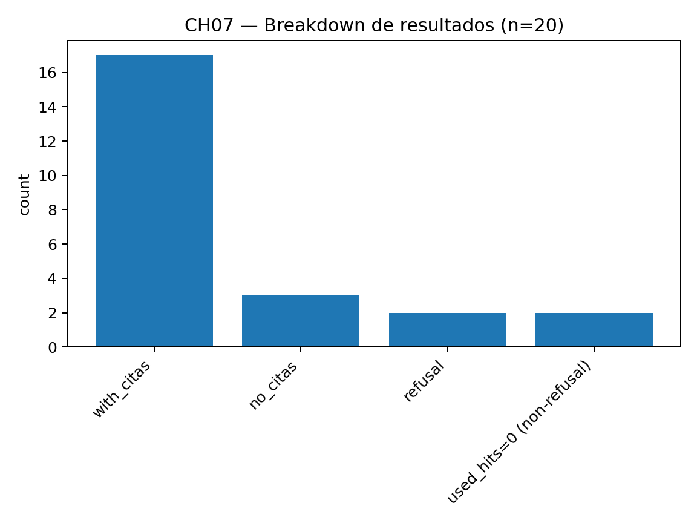
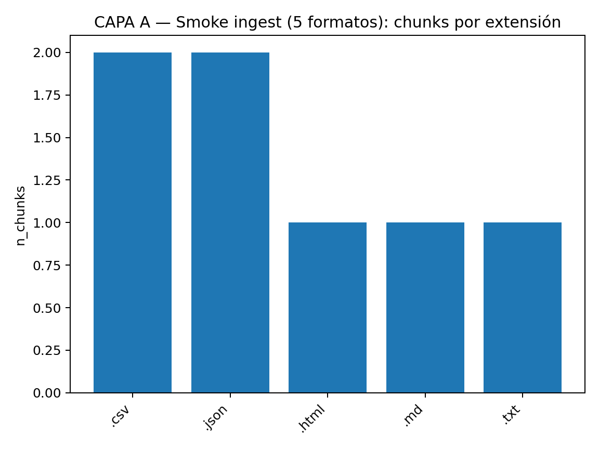

# Asistente-RAG-CORE — README (TFM)
Este repositorio es la base del **Trabajo Fin de Máster (TFM)**: construcción de un **asistente RAG (Retrieval-Augmented Generation)** orientado a trabajar con documentación de licitaciones (principalmente en español).

El caso de uso y la documentación de ejemplo provienen de una **licitación pública en Chile** (Ministerio de Transportes y Telecomunicaciones). En una primera aproximación utilicé la funcionalidad nativa de ChatGPT (Workspace y GPTs especializados) para analizar PDFs; aunque el resultado fue razonable, no alcanzó el nivel de **trazabilidad**, **control** y **reproducibilidad** necesario para un proceso defendible.

La estrategia del repo es incremental y por capas: primero “plumbing” + reproducibilidad; después indexación real, retrieval real y evaluación.

## Tabla de contenidos
- [Executive Summary](#executive-summary)
- [Quickstart (5 minutos)](#quickstart-5-minutos)
- [Mapa del repositorio](#mapa-del-repositorio)
- [1. Contexto y motivación](#1-contexto-y-motivación)
- [2. Datos / Documentos y formatos](#2-datos--documentos-y-formatos)
- [3. Arquitectura del sistema](#3-arquitectura-del-sistema)
- [4. Preparación / Chunking / Metadatos](#4-preparación--chunking--metadatos)
- [5. Modelos y Vector DB](#5-modelos-y-vector-db)
- [6. Evaluación](#6-evaluación)
- [7. Mejora propuesta + impacto](#7-mejora-propuesta--impacto-baseline--mejora--evidencia)
- [8. Dificultades y cómo se resolvieron](#8-dificultades-y-cómo-se-resolvieron)
- [9. Reproducibilidad / Runbook / Cómo ejecutar](#9-reproducibilidad--runbook--cómo-ejecutar)
- [10. Aprendizajes](#10-aprendizajes)
- [11. Limitaciones y trabajo futuro](#11-limitaciones-y-trabajo-futuro-prioridad-ocrpdf-automático)

## Executive Summary

- **Problema real**: En licitaciones del sector público, la documentación llega frecuentemente como **PDF escaneado con OCR imperfecto**, lo que introduce ruido (tokens corruptos, saltos de línea, tablas rotas) y degrada la recuperación de evidencia y la calidad de las respuestas.
- **Qué se construyó**: Un **asistente RAG por capas** (CAPA A–D) con ingesta, chunking+metadatos, retrieval con umbral y generación con citas, diseñado para ser **reproducible y trazable** (evidencia auditable).
- **Formatos soportados + evidencia**: La ingesta soporta **MD / CSV / JSON / TXT / HTML**. La evidencia reproducible (smoke) de CAPA A está versionada y muestra `by_source_ext` con las 5 extensiones en: `eval_artifacts/capaA/ingest_smoke_5fmt/chunk_stats.json`.
- **Embeddings + Vector store (verificable)**:
  - Modelo de embeddings: `sentence-transformers/paraphrase-multilingual-MiniLM-L12-v2` (**dim=384**, CPU).
  - Vector store: **FAISS** con índice `IndexFlatIP` (similaridad coseno vía embeddings L2-normalizados).
  - Artefactos persistidos: `data/index/faiss.index`, `data/index/meta.jsonl`, `data/index/chunks.jsonl` (ver `data/index/manifest.json`).
- **Evaluación realizada (benchmarks)**: Se ejecutaron y documentaron benchmarks reproducibles para: **CH04 (Retrieval v2)**, **CH06 (Negativo / NO_ANSWER v2)** y **CH07 (Generativo v1 con citas)**, con comandos exactos y resultados en `docs/` + `docs/RUNBOOK_EVAL_WSL.md`.
- **Resultados auditables sin ejecutar**: Los resultados generativos pueden auditarse directamente en GitHub con snapshots versionados: `eval_artifacts/ch07/eval_generative_v1.json` y `eval_artifacts/ch07/generative_raw_v1/gen_XXX.txt` (sin depender de `reports/`, que es output local).

### Resultados clave (resumen)

| Benchmark | Dataset | Resultado clave | Artefactos |
|---|---:|---|---|
| CH04 Retrieval v2 | n=50 | hit@20=1.00 · recall@20=1.00 | `docs/CH04_Benchmark_Retrieval_v2.md` |
| CH06 Negativo v2 | n=20 | NO_ANSWER acc (tolerant)=1.00 · (strict)=1.00 | `docs/CH06_Benchmark_Negativo_v2.md` |
| CH07 Generativo v1 | n=20 | coverage=0.80 · purity=1.00 · refusal=0.10 | `docs/CH07_Benchmark_Generativo_v1.md` + `eval_artifacts/ch07/` |


## Quickstart (5 minutos)
> Objetivo: que un evaluador pueda **clonar, ejecutar una demo** y **reproducir al menos un benchmark** sin leer todo el documento.

### 0) Prerrequisitos
- Recomendado: **WSL Ubuntu** como entorno de ejecución “source of truth”.
- Python (según tu entorno del proyecto) + `git`.
- Si vas a usar `--backend openai`, configura tu API key (por ejemplo `OPENAI_API_KEY`).

Ejemplo (WSL/Linux):
```bash
export OPENAI_API_KEY="tu_api_key"
```

### 1) Clonar repositorio
```bash
git clone https://github.com/inigodg-sys/Asistente-rag-core.git
cd Asistente-rag-core
```

### 2) Activar entorno y preparar `PYTHONPATH`
```bash
cd Asistente-rag-core

# Si ya tienes un venv WSL existente:
#   source .venv_wsl/bin/activate
# Si NO lo tienes, crea uno rápido:
python3 -m venv .venv
source .venv/bin/activate

# Instala dependencias (elige una):
#   pip install -r requirements.lock.txt
#   pip install -r requirements.txt
pip install -r requirements.txt

export PYTHONPATH=$PWD/src
```

### 3) Responder una pregunta (demo RAG)
```bash
python3 cli/answer.py \
  --backend openai \
  --llm_model gpt-4.1-mini \
  -k 20 \
  --min_score 0.35 \
  --max_sources 10 \
  "¿Cuál es el plazo de evaluación técnica según el cronograma?"
```

Si no tienes API key (o quieres una demo offline), puedes usar backends sin red:
```bash
python3 cli/answer.py \
  --backend deterministic \
  -k 20 \
  --min_score 0.35 \
  --max_sources 10 \
  "¿Cuál es el plazo de evaluación técnica según el cronograma?"
```


### 4) Reproducir benchmarks (CH04/CH06/CH07)
Los comandos exactos están en:
- `docs/RUNBOOK_EVAL_WSL.md`

### 5) Dónde ver outputs (sin ejecutar)
- Snapshots auditables: `eval_artifacts/`
- Gráficos: `assets/`
- Documentación de benchmarks: `docs/CH04_*`, `docs/CH06_*`, `docs/CH07_*`

## Mapa del repositorio

Estructura lógica (carpetas relevantes para el tribunal):

- `README.md` → este documento (narrativa + cómo ejecutar).
- `cli/` → interfaces de ejecución (`answer.py`, `ask.py`).
- `src/rag_core/` → núcleo del pipeline (ingesta, indexado, retriever, generator).
- `data/raw/` → corpus por formato (`web/`, `csv/`, `json/`, `imagenes/`).
- `data/index/` → índice persistido (FAISS + metadata + manifest).
- `eval/` → “gold” datasets (`gold_retrieval_*`, `gold_negative_*`, `gold_generative_*`).
- `tools/` → scripts de evaluación y utilidades (retrieval/generative/negative, evidencia, plots).
- `docs/` → documentación ampliada + resultados interpretados (benchmarks + runbook).
- `eval_artifacts/` → snapshots versionados para auditoría sin ejecutar (p.ej. CH07, CAPA A).
- `assets/` → imágenes incluidas en el README (plots de CAPA A/CH07).
- `tests/` → tests unit/integration (contratos y smoke).
- `reports/` → outputs locales (no necesarios para auditoría; se explica en el README).

## 1. Contexto y motivación

### Mini caso, (Caso real Licitacion Chile Ministerio de Transporte y Telecomunicación)

En un proceso real de preparación de respuesta a licitaciones, la documentación llega mayoritariamente como **PDF** (a menudo escaneado) y depende de **OCR** para extraer texto. En la práctica, el OCR introduce artefactos frecuentes: palabras “rotas” por saltos de línea, caracteres confundidos, y tablas que se convierten en texto desordenado. El resultado es que, incluso si “hay información” en el documento, la búsqueda por similitud puede recuperar fragmentos incompletos o irrelevantes, y la generación corre el riesgo de producir respuestas **sin evidencia sólida**.

### Decisión técnica: separar conversión PDF→texto del pipeline RAG reproducible

Para maximizar **reproducibilidad** y calidad del retrieval, este proyecto separa dos fases:

- **Fase de conversión (preproceso)**: PDF/OCR → formatos textuales estables (MD/TXT/JSON/CSV/HTML). En el TFM se realiza de forma controlada (manual/semiautomática) para evitar variabilidad y ruido no determinista.
- **Pipeline RAG (TFM)**: ingesta multiformato, limpieza/normalización, chunking con metadatos trazables, embeddings + FAISS, retrieval con umbral y generación con citas, con evaluación reproducible (CH04/CH06/CH07).

Esta separación refleja una decisión: el “document engineering” del OCR puede convertirse en un subproyecto en sí mismo; en cambio, el objetivo del TFM es demostrar un RAG **medible**, **auditable** y **defendible**.

---

## 2. Datos / Documentos y formatos

### 2.1 Origen de los documentos (contexto real)

El corpus de este proyecto refleja documentación aportada y utilizada durante la licitación citada anteriormente, el trabajo real se realizo durante el mes de Diciembre de 2024. El formato incluia  bases, anexos, definiciones, formularios y tablas. 

### 2.2 Organización del corpus (carpetas reales del repo)

El repositorio organiza los inputs de ingesta en:

- `data/raw/web/` → documentos “text-like” (MD/TXT/HTML)
- `data/raw/csv/` → tablas en CSV
- `data/raw/json/` → definiciones/estructuras en JSON
- `data/raw/imagenes/` → material visual (fuera del scope de ingesta textual; relevante para trabajo futuro OCR/layout)

Esta organización permite mantener la ingesta reproducible por tipo de fuente, y facilita la trazabilidad `source → chunk → cita`.

### 2.3 Formatos soportados y evidencia auditable

La ingesta soporta explícitamente estos 5 formatos:

- **MD** (`.md`)
- **CSV** (`.csv`)
- **JSON** (`.json`)
- **TXT** (`.txt`)
- **HTML** (`.html`, `.htm`)

**Evidencia reproducible versionada (CAPA A)**

Se incluye un “smoke corpus” que demuestra que el pipeline ingiere los 5 formatos y genera chunks trazables. La evidencia está versionada para auditoría en GitHub:

- `eval_artifacts/capaA/ingest_smoke_5fmt/chunk_stats.json`

En particular, el campo `by_source_ext` muestra la presencia de: `.md`, `.csv`, `.json`, `.txt`, `.html`.

### 2.4 Tipología semántica (`doc_type`) y cómo se infiere (regla real)

Cada documento se etiqueta con un `doc_type` que guía chunking y/o tratamiento:

`normativa`, `tabla`, `definicion`, `tutorial`, `formulario`.

La inferencia se realiza en `src/rag_core/ingest.py` siguiendo esta lógica (simplificada, pero fiel al código):

1) Si el nombre del archivo contiene pistas de **formulario** (por ejemplo `"a06"` o `"formulario"`), entonces `doc_type="formulario"`.
2) Si el nombre contiene pistas de **tutorial** (por ejemplo `"rag"`, `"tutorial"`, `"guia"`/`"guide"`), entonces `doc_type="tutorial"`.
3) Si el formato es **CSV**, entonces `doc_type="tabla"`.
4) Si el formato es **JSON**, entonces `doc_type="definicion"` (o extracción de definiciones cuando existe estructura tipo `{id, termino/término, definicion/definición}`).
5) En caso contrario, por defecto `doc_type="normativa"`.

Esto permite mantener una semántica consistente y reproducible, y facilita auditoría en retrieval/citas.

## 3. Arquitectura del sistema

### 3.1 Narrativa de alto nivel (del problema a la solución)

El “dolor real” del caso (PDF escaneado + OCR ruidoso) no se resuelve solo con un LLM: primero hay que construir una tubería que garantice texto estable, trazabilidad de evidencia y reproducibilidad. Por eso el sistema se organiza en capas (CAPA A–D): cada capa tiene una responsabilidad clara, produce artefactos verificables, y permite evaluar mejoras sin romper el resto.

### 3.2 Diagrama end-to-end (pipeline RAG + evaluación)

flowchart LR
  A["Fuentes documentales<br/>MD/CSV/JSON/TXT/HTML"] --> B["CAPA A: Ingesta + Normalización<br/>doc_type + chunking"]
  B --> C["CAPA B: Embeddings + Indexado FAISS<br/>manifest + meta"]
  C --> D["FAISS index<br/>data/index/faiss.index"]
  Q["Pregunta usuario"] --> E["CAPA C: Retriever<br/>top-k + min_score"]
  D --> E
  E --> F["CAPA C: Generator/LLM<br/>max_sources + higiene de citas"]
  F --> G["Respuesta + Citas<br/>si hay evidencia"]
  G --> H["CAPA D: Benchmarks<br/>CH04/CH06/CH07 + artefactos"]


### 3.3 CAPA A — Ingesta multiformato (reproducible)

Responsabilidad: convertir documentos heterogéneos en una representación uniforme de chunks trazables.

- Inputs: data/raw/web (MD/TXT/HTML), data/raw/csv, data/raw/json (+ data/raw/imagenes).
- Salida conceptual: lista de Chunk con id, source, doc_type, section, metadatos.

Por qué importa para el TFM: esta capa es donde “domamos” el ruido de formatos y preparamos evidencia para retrieval.

### 3.4 CAPA B — Embeddings + Vector store (FAISS)

Responsabilidad: convertir chunks a vectores y construir un índice persistido y consistente.

- Modelo de embeddings (verificable en data/index/manifest.json):
  - sentence-transformers/paraphrase-multilingual-MiniLM-L12-v2 (dim=384, CPU)
- Vector store: FAISS IndexFlatIP (cosine via L2-normalized embeddings)
- Artefactos persistidos:
  - data/index/faiss.index (índice)
  - data/index/meta.jsonl (metadatos por vector/chunk)
  - data/index/chunks.jsonl (texto por chunk)
  - data/index/manifest.json (hashes, parámetros, num_vectors, dim, paths)

Chequeo de integridad clave: el loader valida consistencia index.ntotal == len(meta) (evita índices corruptos o desalineados).

### 3.5 CAPA C — Retrieval + Generación con evidencia (RAG)

Responsabilidad: responder preguntas con soporte de evidencia y control de calidad.

- Retriever: carga FAISS + meta y devuelve candidatos por similitud.
  - Controles:
    - k (top-k recuperados)
    - min_score (umbral para filtrar evidencia débil)
- Generator/LLM: genera respuesta usando un número limitado de fuentes:
  - max_sources (p.ej. 10) para evitar “perder evidencia” en preguntas multi-hop
  - higiene de citas: si la salida es tipo NO_ANSWER/refusal, se evita añadir “Citas:” para no dar autoridad falsa.

Cuando el OCR/ruido/umbral produce used_hits=0, el sistema puede (a) abstenerse (NO_ANSWER) o (b) responder con cautela. En este TFM lo tratamos como hallazgo y lo medimos en CH07.

### 3.6 CAPA D — Evaluación y evidencia (benchmarks)

Responsabilidad: medir calidad de forma reproducible y dejar evidencia “auditable”.

- CH04: Benchmark Retrieval (gold retrieval v2)
- CH06: Benchmark Negativo / NO_ANSWER
- CH07: Benchmark Generativo con citas (cobertura, pureza de citas, refusals)

Artefactos auditables:

- docs/CH04_Benchmark_Retrieval_v2.md, docs/CH06_Benchmark_Negativo_v2.md, docs/CH07_Benchmark_Generativo_v1.md
- docs/RUNBOOK_EVAL_WSL.md
- snapshots en eval_artifacts/ para revisar sin ejecutar (por ejemplo CH07 y CAPA A smoke 5 formatos).

### 3.7 Por qué esta arquitectura

- Aísla riesgos (OCR/preproceso) del núcleo evaluable.
- Garantiza trazabilidad (source→chunk→retrieval→cita).
- Permite comparar baseline vs mejora sin reescribir todo.
- Cumple el requisito de repo “completo” del TFM: código + outputs + visualizaciones + explicación del sistema.

## 4. Preparación / Chunking / Metadatos

### 4.1 Por qué esta capa decide la calidad del RAG

En nuestro caso, el problema no es “falta de LLM”, sino falta de texto estable y de fragmentos recuperables. En un RAG, si los chunks están mal construidos (ruido, mezcla de secciones, tablas rotas), el retrieval se vuelve inestable y el generador pierde evidencia, lo que reduce calidad y empeora la trazabilidad de citas.

Por eso, este proyecto prioriza:

- normalización y limpieza (especialmente para ruido OCR),
- chunking consistente y reproducible,
- metadatos suficientes para auditar source → chunk → retrieval → cita.

### 4.2 Limpieza y normalización (text-like)

El repositorio incluye utilidades de limpieza para formatos textuales, por ejemplo:

- clean_markdown.py / clean_markdown_v2.py para normalizar Markdown
- cleaning.py como capa de normalización complementaria

En términos prácticos:

- MD/TXT/HTML se convierten a texto “estable” y se normalizan (encoding, espacios, saltos de línea).
- En entradas con ruido OCR, se aplica un paso de corrección (por ejemplo, corrección de tokens corruptos típicos) antes de chunkear, para que retrieval no “pierda” palabras clave.

Decisión de diseño: el HTML se reduce a texto (sin dependencias pesadas) para convertirlo en “text-like”, manteniendo el pipeline reproducible.

### 4.3 Transformación por tipo de formato (lo que realmente se embeddea)

Para construir embeddings + FAISS, todo se convierte a texto indexable. Por ello:

- MD/TXT/HTML → texto plano normalizado → chunking por longitud.
- CSV → cada fila se convierte en un “registro textual” (p.ej. col1=...; col2=...) y se chunkea o se indexa como unidad.
- JSON → se extraen definiciones cuando existe estructura tipo {id, termino/término, definicion/definición} y cada definición se convierte en texto “termino: definición”.

Esta normalización unifica la ingesta multiformato en un contrato común (chunks + metadatos), requisito clave para un RAG evaluable.

### 4.4 Chunking: objetivos y trade-offs

El chunking se diseña para equilibrar:

- recall (no partir demasiado la evidencia),
- precision (evitar chunks enormes con ruido o múltiples temas),
- trazabilidad (IDs estables).

Parámetros exactos para documentos de tipo **normativa** (según `src/rag_core/ingest.py`):

- `normative_target_chars = 800`
- `normative_max_chars = 900`
- `normative_overlap_chars = 120`

Interpretación:

- Un objetivo ~800 chars captura unidades semánticas razonables en texto normativo.
- Un máximo 900 evita “chunks demasiado largos”.
- Un overlap 120 reduce el riesgo de cortar una frase/requisito crítico en el borde del chunk.

Esto se aplica especialmente a documentos “normativa” (texto largo). Para tablas/definiciones, el chunking tiende a ser por unidad lógica (fila o definición).

### 4.5 Metadatos: el contrato que hace el sistema “auditable”

Cada chunk generado incluye metadatos mínimos para auditoría:

- id: identificador estable del chunk (permite referenciarlo en resultados y debugging)
- source: ruta del fichero de origen (trazabilidad)
- doc_type: tipología semántica (normativa, tabla, definicion, tutorial, formulario)
- section: sección lógica (cuando aplica)
- metadatos: extras como índice de chunk o fila

Esto se refleja también en la evidencia reproducible (CAPA A). Por ejemplo, en los stats del smoke aparecen IDs como demo:row:0 / def:D1, lo que confirma que el pipeline produce identificadores interpretables y trazables.

### 4.6 Evidencia reproducible (CAPA A) de que la preparación funciona

Para demostrar de forma objetiva que:

- se ingieren 5 formatos,
- se generan chunks con metadatos coherentes,

se versiona evidencia de smoke en GitHub:

- eval_artifacts/capaA/ingest_smoke_5fmt/chunk_stats.json

Incluye:

- by_source_ext: muestra .md/.csv/.json/.txt/.html
- sample_ids: ejemplos de IDs generados
- métricas simples de longitud (min/mean/max) para validar consistencia del chunking

### 4.7 Ablación de overlap (0 vs 120): robustez vs coste

**Objetivo**: evaluar si el solape entre chunks mejora la captura de evidencias cuando una frase cae cerca del límite de chunk, y cuantificar el coste (número de chunks).

**Configuración** (caso de prueba):

- Documento: `data/raw/web/03_de_la_licitacion.md`
- Evidencia: “El plazo del contrato será de ciento cuarenta y cuatro (144) meses …”
- Comparativa: `overlap=0` vs `overlap=120` (valor por defecto del pipeline)
- Script: `tools/overlap_hit_144.py`

**Resultados**:

- `overlap=0`: 77 chunks, 1 hit
- `overlap=120`: 113 chunks, 1 hit

**Conclusión**:

En este caso concreto, el solape **no mejora** la cobertura (la evidencia cabe completa en un chunk en ambos escenarios), pero **incrementa el coste** (más chunks → más embeddings/indexado).

Se mantiene `overlap=120` como valor por defecto **por robustez** ante evidencias cercanas a cortes en otros documentos, con nota de que el valor óptimo depende del corpus y puede ajustarse en trabajo futuro.

## 5. Modelos y Vector DB

### 5.1 Por qué “modelo + índice” es la base del retrieval

Una vez normalizados los documentos y construidos los chunks (CAPA A), el sistema necesita una representación numérica que permita recuperar evidencia por similitud. En este proyecto, eso se logra con:

- Embeddings densos (modelo multilingüe)
- Vector store persistido (FAISS)
- Contrato de persistencia + trazabilidad (manifest + meta + chunks)

Esta capa es crítica porque determina:

- qué tan bien se recupera evidencia relevante,
- la estabilidad experimental (reproducibilidad),
- y la trazabilidad necesaria para justificar citas.

### 5.2 Modelo de embeddings (exacto, verificable)

El modelo de embeddings usado para vectorizar los chunks está registrado en data/index/manifest.json:

- Modelo: sentence-transformers/paraphrase-multilingual-MiniLM-L12-v2
- Dimensión: 384
- Device: cpu

Justificación técnica:

- Es un modelo multilingüe, adecuado para documentación en español.
- Tiene dimensionalidad moderada (384) → buen equilibrio calidad/latencia para un pipeline reproducible.

### 5.3 Vector DB / índice (FAISS) y tipo de similitud

El vector store se implementa con FAISS y un índice simple, estable y reproducible:

- FAISS index type: IndexFlatIP
- Similitud: “cosine via L2-normalized embeddings” (coseno mediante normalización L2 previa)

Esto está explícito en el código de construcción del índice (src/rag_core/index_faiss.py) y se registra también en manifest.json como:

- "index_type": "IndexFlatIP (cosine via L2-normalized embeddings)"

Interpretación:

- IndexFlatIP usa producto interno.
- Si los embeddings están L2-normalizados, el producto interno equivale a coseno → similitud estable y fácil de razonar.

### 5.4 Construcción del índice (pipeline, artefactos y contratos)

La construcción del índice se realiza en src/rag_core/index_faiss.py mediante build_index(...). A nivel de flujo:

- Entrada: chunks_path (JSONL con chunks)
- Embedder: se crea con get_embedder(model_name=..., device=...)
- Index: se instancia faiss.IndexFlatIP(d)
- Persistencia:
  - faiss.write_index(index, index_path) guarda el índice
  - se escribe meta.jsonl con la metadata asociada
  - se escribe manifest.json con hashes y parámetros (reproducibilidad)

Artefactos persistidos:

- data/index/faiss.index → índice FAISS
- data/index/meta.jsonl → metadata por vector/chunk
- data/index/chunks.jsonl → chunks persistidos
- data/index/manifest.json → contrato de reproducibilidad (hashes, modelo, dim, tipo de índice, rutas)

Este diseño cumple un objetivo clave del TFM: reproducibilidad. Si el corpus cambia, el hash de chunks.jsonl cambia, y el manifest lo refleja.

### 5.5 Carga del índice y chequeos de integridad (evita bugs silenciosos)

El retrieval carga el índice y valida consistencia en src/rag_core/retriever.py:

- Carga índice: faiss.read_index(str(index_path))
- Carga metadata: load_meta(meta_path)
- Chequeo crítico: index.ntotal == len(meta)

Este chequeo evita un fallo típico en sistemas RAG: índice y metadata desalineados (lo que produce citas incorrectas o retrieval corrupto sin error explícito).

### 5.6 Conexión con evaluación y parámetros de retrieval

En CAPA C, el retriever usa:

- k (top-k recuperados)
- min_score (umbral para filtrar evidencia débil)

Estos parámetros están justificados experimentalmente en CH04/CH06/CH07, y son parte del “baseline vs mejora” del proyecto.

## 6. Evaluación

### 6.1 Cómo demostramos calidad de extremo a extremo

Para que un sistema RAG sea defendible en un contexto de licitaciones, no basta con responder “bien” cuando hay evidencia: también debe (1) recuperar evidencia de forma consistente, (2) abstenerse correctamente cuando no existe evidencia suficiente, y (3) generar respuestas trazables con citas cuando sí hay soporte documental.

Por eso la evaluación se organiza en tres benchmarks reproducibles (CAPA D), cada uno cubriendo un riesgo distinto:

- **CH04 (Retrieval v2):** ¿recuperamos evidencia correcta cuando existe?
- **CH06 (Negativo/NO_ANSWER v2):** ¿nos abstenemos cuando NO existe evidencia?
- **CH07 (Generativo v1):** ¿generamos con citas, con cobertura y sin citar fuentes no usadas?

Los comandos reproducibles están documentados en `docs/RUNBOOK_EVAL_WSL.md`.

### 6.2 Tabla resumen (benchmarks y qué prueban)

| Capítulo | Qué evalúa | Gold/Dataset | Métricas clave | Dónde ver resultados |
|---|---|---|---|---|
| CH04 | Calidad de retrieval (evidence-first) | `eval/gold_retrieval_v2.csv` (n=50) | hit@k, recall@k, missing_q | `docs/CH04_Benchmark_Retrieval_v2.md` |
| CH06 | Correctitud de NO_ANSWER | `eval/gold_negative_v1.csv` (n=20) | no_answer_accuracy tolerant/strict | `docs/CH06_Benchmark_Negativo_v2.md` |
| CH07 | Generación con evidencia y citas | `eval/gold_generative_v1.csv` (n=20) | has_citas_rate, coverage, purity, refusal_rate | `docs/CH07_Benchmark_Generativo_v1.md` + `eval_artifacts/ch07/` |

> Nota operativa: `reports/` se trata como output local. Para auditoría sin ejecutar, se versionan snapshots mínimos en `eval_artifacts/` (ya disponible para CH07 y CAPA A).

### 6.3 CH04 — Retrieval v2 (resultado final)

El gold `gold_retrieval_v2` se calibró mediante metodología **evidence-first** hasta converger en un benchmark “justo” (sin evidencias imposibles por chunking/ranking). El criterio de cierre fue `missing_q = 0/50` para k=20.

**Resultado final (v2, n=50):**

- **k = 20 → hit@20 = 1.0, recall@20 = 1.0** (calibrado, `missing_q=0/50`)

Interpretación:

- El benchmark demuestra que el sistema puede recuperar todas las evidencias esperadas bajo la configuración de calibración (k=20), validando la trazabilidad `expected_ids → got_ids`.

### 6.4 CH06 — Negativo / NO_ANSWER (resultado final)

CH06 mide robustez y seguridad semántica: cuando no existe evidencia suficiente, el sistema debe abstenerse y evitar “falsa autoridad” (no citar en NO_ANSWER).

Configuración final (según benchmark):

- `k=10`, `min_score=0.35`, `backend=openai`, `llm_model=gpt-4o-mini`, `n=20`

**Métricas finales (v4):**

- **No-Answer Accuracy (Tolerant): 1.00 (20/20)**
- **No-Answer Accuracy (Strict): 1.00 (20/20)**

Interpretación:

- Tolerant=1.00 ⇒ abstención correcta en todos los casos (sin alucinación).
- Strict=1.00 ⇒ además, no se adjuntan citas en abstención (higiene de citas).

### 6.5 CH07 — Generativo con citas (resultados y visualización)

CH07 evalúa generación con evidencia (n=20), midiendo presencia de citas, cobertura, pureza (solo fuentes usadas) y tasa de rechazo.

Métricas (summary CH07):

- `has_citas_rate = 0.85`
- `mean_citation_coverage = 0.80`
- `citation_only_from_used_rate = 1.00`
- `refusal_rate = 0.10`

Interpretación clave:

- `citation_only_from_used_rate = 1.00` valida “higiene” de citación: no se citan fuentes no utilizadas.
- El 15% sin citas se explica por casos con `used_hits=0` (sin evidencia utilizable bajo `min_score`) y por abstención en `refusal=True`.

**Visualización (CH07 outcomes)**



Artefactos auditables sin ejecutar:

- `eval_artifacts/ch07/eval_generative_v1.json`
- `eval_artifacts/ch07/generative_raw_v1/gen_XXX.txt`

### 6.6 Evidencia de ingesta multiformato y visualización

Para validar de forma objetiva el requisito de formatos (CAPA A), se versiona evidencia reproducible smoke:

- `eval_artifacts/capaA/ingest_smoke_5fmt/chunk_stats.json`

Incluye `by_source_ext` demostrando `.md/.csv/.json/.txt/.html`.

**Visualización (CAPA A by_source_ext)**



## 7. Mejora propuesta + impacto (Baseline → Mejora → Evidencia)

### 7.1 Por qué una “mejora” en RAG debe ser medible

En un entorno real de licitaciones, el valor del RAG no es solo “contestar”, sino **contestar con evidencia** y **saber abstenerse** cuando no hay soporte. Por eso, cualquier mejora propuesta debe:

- ser concreta (cambio de configuración/código identificable),
- ser reproducible (runbook),
- y tener impacto medido (benchmarks).

Este proyecto sigue una estrategia incremental: baseline funcional → ajustes controlados → benchmarks (CH04/CH06/CH07) → decisiones.

### 7.2 Baseline (estado inicial razonable)

Baseline del sistema antes del cierre final:

- Pipeline RAG operativo (ingesta → embeddings → FAISS → retrieval → generación).
- Generación con un número limitado de fuentes en el generador determinista:
  - `max_sources = 3` por defecto en `GeneratorConfig` (cuántos chunks se usan para responder).
- Ingesta multiformato en progreso (MVP inicial centrado en text-like).
- Evaluación aún no consolidada en un paquete reproducible completo.

**Riesgo baseline**:

- Respuestas multi-hop o que requieren varias evidencias pueden “perder soporte” si se limita demasiado el número de fuentes utilizadas.
- Sin umbral calibrado, el retrieval puede traer evidencia débil (o nada) sin explicación clara.
- Sin higiene explícita, existe riesgo de “autoridad falsa” si se adjuntan citas cuando el sistema realmente está absteniéndose.


### 7.3 Mejora (técnica principal) — *Evidence gating* para respuestas defendibles

Para cumplir el requisito de “una técnica de mejora” (fase 2), la mejora central del proyecto es **evidence gating**:

- **Retrieval con umbral** (`min_score`) para filtrar evidencia débil.
- **Política de abstención** (NO_ANSWER/refusal) cuando no hay evidencia utilizable.
- **Higiene de citas**: si la respuesta es NO_ANSWER/refusal, **no** se añade el bloque “Citas:”, evitando falsa autoridad.

Esto transforma el sistema de “responder por defecto” a “responder solo si hay soporte documental”.

#### Configuración: baseline vs mejora

> El baseline refleja el comportamiento previo a la calibración del umbral (sin evidence gating). La mejora introduce un umbral y la política de abstención.

| Variante | k | min_score | max_sources | Política NO_ANSWER | Citas en NO_ANSWER |
|---|---:|---:|---:|---|---|
| Baseline (fase 1) | 20 | 0.00 (sin umbral) | 3 | No sistemática | Podían aparecer |
| Mejora (fase 2) | 20 | 0.35 (calibrado) | 10 | Sí (cuando used_hits=0) | Nunca |

> Nota: `max_sources` y el cierre multiformato son **hardening/cumplimiento de requisitos** para hacer la evaluación estable; la técnica de mejora evaluada es el *evidence gating*.

### 7.4 Impacto (métricas medidas)

El impacto se demuestra con los benchmarks reproducibles:

**(A) Retrieval — CH04 (v2, n=50)**

- `k=20` → **hit@20 = 1.0**, **recall@20 = 1.0** (calibrado con `missing_q=0/50`)  
  Interpretación: el retrieval recupera la evidencia esperada bajo la configuración de cierre.

**(B) Abstención/NO_ANSWER — CH06 (v4 final, n=20)**

- **No-Answer Accuracy (Tolerant) = 1.0 (20/20)**
- **No-Answer Accuracy (Strict) = 1.0 (20/20)**

Interpretación: el sistema se abstiene correctamente cuando no hay evidencia, y además mantiene higiene de citas (no “Citas:” en abstención).

**(C) Generación con citas — CH07 (v1, n=20)**

- `has_citas_rate = 0.85`
- `mean_citation_coverage = 0.80`
- `citation_only_from_used_rate = 1.00`
- `refusal_rate = 0.10`

Interpretación:

- Pureza perfecta (1.00) → las citas solo provienen de fuentes realmente usadas.
- El 15% sin citas se explica por `used_hits=0` (sin evidencia utilizable bajo `min_score`) o por abstención con higiene.

**(D) Multiformato — CAPA A smoke (evidencia versionada)**

- `eval_artifacts/capaA/ingest_smoke_5fmt/chunk_stats.json` muestra `by_source_ext` con `.md/.csv/.json/.txt/.html`.  
  Interpretación: se cumple el requisito de 5 formatos con evidencia auditable.

### 7.5 Conclusión de mejora

La mejora final no es un “cambio estético”, sino un cierre de ingeniería:

- retrieval calibrado y demostrablemente correcto (CH04),
- abstención segura (CH06),
- generación trazable con citas “limpias” (CH07),
- multiformato demostrado (CAPA A).

Todo ello con comandos reproducibles (runbook) y evidencia versionada en GitHub.

## 8. Dificultades y cómo se resolvieron

### 8.1 Los problemas reales son parte del proyecto

 Este capítulo incorpora las dificultades encontradas como parte del diseño, con decisiones explícitas y evidencia reproducible.

### 8.2 Entorno Windows vs WSL (dependencias y estabilidad)

**Problema**: En Windows surgieron bloqueos de dependencias (Torch/policy) que afectaban la ejecución reproducible del pipeline.

**Decisión**: Establecer **WSL Ubuntu como entorno de ejecución “source of truth”**, y usar Windows solo como espejo (sin commits ni ejecuciones críticas).

**Solución aplicada**:

- Regla anti-desync: commits y ejecuciones solo en WSL (`~/repos/...`).
- Sincronización del espejo Windows con `fetch` + `reset --hard origin/main` cuando sea necesario.

**Impacto**: elimina variabilidad por sistema operativo y evita “estado divergente”.

### 8.3 Ruido OCR y normalización del texto

**Problema**: OCR imperfecto introduce errores sistemáticos (tokens corruptos, saltos de línea, tablas rotas). Esto degrada embeddings y retrieval, y puede llevar a respuestas sin evidencia clara.

**Decisión**: Separar el OCR (PDF→texto) como **preproceso** y mantener el núcleo RAG sobre formatos textuales estables (MD/TXT/HTML/CSV/JSON).

**Solución aplicada**:

- Limpieza/normalización en CAPA A (`clean_markdown*`, `cleaning.py`).
- Corrección de ruido OCR típica (p.ej. tokens corruptos) antes de chunking, para mejorar recuperabilidad.

**Impacto**: chunks más “limpios” → retrieval más estable → mejores citas y menor riesgo de falsa autoridad.

### 8.4 “Higiene de citas” y el caso has_citas_rate < 1.0

**Problema aparente**: en CH07, `has_citas_rate` no es 1.0. Un lector superficial podría interpretarlo como “fallo de citación”.

**Diagnóstico real**:

- Los casos sin citas se explican por **ausencia de evidencia utilizable** (`used_hits=0`) bajo el umbral `min_score`, o por **abstención** (`refusal=True`).
- En esos casos, añadir citas podría crear **falsa autoridad** (parecer respaldado cuando el sistema realmente no lo está).

**Solución aplicada**:

- Regla explícita: si la respuesta es tipo NO_ANSWER/refusal, **no adjuntar** bloque “Citas:”.
- Métrica clave para auditoría: `citation_only_from_used_rate = 1.00` (citas solo de fuentes usadas), que valida robustez de trazabilidad.

**Impacto**: mayor seguridad semántica y credibilidad. En licitaciones, es preferible abstenerse correctamente a “inventar con apariencia de evidencia”.

### 8.5 Gestión de cambios y reproducibilidad (Git hygiene)

**Problema**: desincronizaciones WSL/Windows y artefactos locales (`reports/`) pueden generar confusión.

**Solución aplicada**:

- `reports/` como output local efímero.
- `eval_artifacts/` como snapshots auditables versionados (CH07 + CAPA A multiformato), para que el tribunal pueda revisar sin ejecutar.

**Impacto**: experiencia de revisión fluida, auditable y alineada con el requisito del TFM de incluir outputs/resultados en el repo.

## 9. Reproducibilidad / Runbook / Cómo ejecutar

### 9.1 Reproducible = defendible (y auditable)

En un TFM orientado a ingeniería, “funciona en mi máquina” no es suficiente. Este proyecto se diseñó para que:

- cualquier evaluador pueda reproducir benchmarks con comandos exactos,
- los outputs importantes sean auditables sin ejecutar (snapshots versionados),
- y el entorno de ejecución esté controlado (WSL como fuente de verdad).

### 9.2 Entorno recomendado (WSL como source-of-truth)

**Regla operativa**:

- Ejecutar y commitear **siempre** desde: `~/repos/Asistente-rag-core` (WSL).
- El repo en Windows (`/mnt/c/...` o `C:\repos\...`) es solo espejo y se sincroniza con `fetch/reset` cuando sea necesario.

Esto elimina desincronizaciones y reduce problemas de dependencias (especialmente en librerías nativas).

### 9.3 Setup mínimo (WSL)

```bash
cd ~/repos/Asistente-rag-core
source .venv_wsl/bin/activate  # si existe
export PYTHONPATH=$PWD/src
```

### 9.4 Demo: responder una pregunta (CLI verificado)

El CLI cli/answer.py expone parámetros clave de retrieval y generación:

- `-k` / `--k` (top-k recuperados)
- `--min_score` (umbral de evidencia)
- `--max_sources` (máximo de chunks usados para responder)
- `--backend` (deterministic, mock-llm, openai)
- `--llm_model` (modelo LLM cuando backend=openai)

**Ejemplo de ejecución (config de cierre recomendada):**

```bash
python3 cli/answer.py \
  --backend openai \
  --llm_model gpt-4.1-mini \
  -k 20 \
  --min_score 0.35 \
  --max_sources 10 \
  "¿Cuál es el plazo de evaluación técnica según el cronograma?"
```

Para ver los flags disponibles en la versión del repo:

```bash
python3 cli/answer.py -h
```

### 9.5 Runbook reproducible (benchmarks)

Los benchmarks se reproducen siguiendo:

- docs/RUNBOOK_EVAL_WSL.md

Incluye comandos para:

- CH04 Retrieval v2
- CH06 Negativo v2 (NO_ANSWER)
- CH07 Generativo v1 (citas)

### 9.6 Resultados auditables sin ejecutar (snapshots versionados)

Para facilitar revisión por tribunal sin ejecutar el pipeline, se versionan artefactos mínimos en GitHub:

- CH07: eval_artifacts/ch07/
  - eval_generative_v1.json
  - generative_raw_v1/gen_XXX.txt (1 archivo por pregunta)

- CAPA A (5 formatos): eval_artifacts/capaA/ingest_smoke_5fmt/
  - chunk_stats.json (incluye by_source_ext)
  - run_manifest.json

La política de artefactos está documentada en eval_artifacts/README.md:

- reports/ = output local/efímero
- eval_artifacts/ = snapshots seleccionados y auditables

## 10. Aprendizajes

Lo más importante que he aprendido construyendo este RAG (y que guía el diseño):

- **El cuello de botella real suele ser el dato**: OCR ruidoso y pérdida de estructura degradan embeddings y, por tanto, retrieval.
- **RAG “defendible” requiere política de evidencia**: un umbral (`min_score`) cambia el sistema de “responder siempre” a “responder solo si hay soporte”.
- **Las citas son parte del sistema**: no basta con “poner fuentes”; hay que medir *cobertura* y *pureza* (solo citar lo que realmente se usó).
- **Reproducibilidad es un entregable**: manifests, hashes, snapshots (`eval_artifacts/`) y runbooks (`docs/`) evitan el “works on my machine”.
- **Los negativos importan**: un benchmark NO_ANSWER (CH06) reduce riesgo de alucinación y aumenta credibilidad en contextos de licitación.
- **Pequeños parámetros cambian el comportamiento**: `k`, `min_score` y `max_sources` alteran el trade-off recall/precision y la estabilidad de la respuesta.

## 11. Limitaciones y trabajo futuro (prioridad: OCR/PDF automático)

### 11.1 Limitaciones “diseñadas” para un TFM evaluable

Las limitaciones son decisiones conscientes de alcance para maximizar:

- reproducibilidad,
- trazabilidad (source → chunk → retrieval → cita),
- evaluación medible (CH04/CH06/CH07),
- manteniendo el núcleo RAG estable y defendible.

### 11.2 Prioridad de trabajo futuro: OCR/PDF automático (document engineering)

Limitación actual

- El pipeline evaluado del TFM opera sobre formatos textuales estables (MD/CSV/JSON/TXT/HTML).
- Los PDFs (especialmente escaneados) se tratan como preproceso (manual/semiautomático) debido a:
  - variabilidad de OCR,
  - pérdida de estructura (tablas/columnas),
  - ruido no determinista que degrada embeddings/retrieval/citas.

Por qué OCR/PDF es el siguiente gran salto

En licitaciones reales, PDF es el “formato de verdad”. Automatizarlo de forma robusta aumentaría:

- cobertura documental (más evidencia),
- recall del retrieval,
- y utilidad práctica del sistema sin depender de conversión manual.

Propuesta de integración (sin romper la presente arquitectura por capas)

Manteniendo CAPA A como ingesta reproducible, introduciríamos un módulo previo (Pre-CAPA A o “CAPA 0”) llamado pdf_pipeline con salida a formatos ya soportados:

- Detección de tipo de PDF
  - PDF nativo (texto seleccionable) → extracción directa
  - PDF escaneado → OCR

- Extracción/OCR
  - OCR reproducible (mismo motor, mismas flags) y con registro de versión/config

- Reconstrucción de texto y estructura mínima
  - normalización de saltos de línea
  - heurísticas de tablas (si aplica)
  - eliminación de headers/footers repetidos

- Salida controlada a formatos estables
  - .md (estructura por headings)
  - .txt (texto lineal)
  - .csv (tablas detectadas)
  - .json (metadatos + secciones detectadas)

- Manifest de conversión (auditable)
  - source_pdf, sha256, tool_version, params, output_paths, quality_flags
  - esto evita el “no reproducible” y permite auditoría de tribunal/industrialización

- Criterios de éxito (medibles)
  - Para demostrar mejora real, el OCR/PDF automático debe medirse con:
    - Calidad de texto (reducción de tokens corruptos / líneas partidas)
    - Impacto en retrieval (CH04: recall@k/hit@k mejora o se mantiene con más evidencia)
    - Impacto en generación con citas (CH07: sube coverage o baja used_hits=0)
    - Coste computacional (tiempo de conversión + tamaño del índice)

Recomendación

- Para industrialización realista: empezar por un modo semi-automático:
  - OCR automático + reporte de calidad
  - Revisión humana (tablas críticas, OCR pobre)

Esto maximiza valor sin “quemar” tiempo en edge-cases extremos.

### 11.3 Casos sin evidencia utilizable (used_hits=0)

Hallazgo medido: parte de los casos sin citas se explica por ausencia de evidencia utilizable bajo min_score (used_hits=0).

Cómo lo conecta OCR/PDF: si OCR/PDF se automatiza bien, aumentará el texto útil y debería reducir la frecuencia de used_hits=0.

Trabajo futuro:

- Fallback a NO_ANSWER cuando used_hits=0 para evitar respuestas generales sin evidencia,
- o modo “pedir aclaración” si el sistema se usa interactivo.

### 11.4 Retrieval híbrido y/o reranking

OCR/PDF puede aumentar volumen y ruido: para mantener calidad se recomienda:

- Retrieval híbrido (BM25 + denso),
- Reranking sobre top-k,
- y evaluación de trade-offs (recall/precision) con CH04.

### 11.5 Evaluación generativa más amplia (robustez estadística)

CH07 (n=20) demuestra pipeline y métricas, pero ampliar a 50–100 preguntas daría mayor robustez y permitiría análisis por tipo de documento (doc_type) y por formato origen.

### 11.6 Packaging adicional (si se exige “todo a un click”)

Actualmente reports/ es output local y eval_artifacts/ contiene snapshots auditables.

Como trabajo futuro, se pueden versionar snapshots mínimos también de CH04/CH06 (igual que CH07) para auditoría completa sin ejecución.

