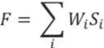

# 5. Evaluacion y adjudicacion

El proeeso de Evaluaci6n eonsiste en cineo (5) etapas eonsecutivas que seran revisadas por la Comisi6n. La primera etapa eorresponde a la apertura de las ofertas teenieas en la cual se revisara que se eneuentren todos los doeumentos requeridos y eumpla eon los plazos y exigencias de las bases, la segunda etapa es la de admisibilidad, en la eual, la Comisi6n revisara y analizara los doeumentos solicitados eomo anteeedentes genera les y tecnieos a los Oferentes. En Ja tereera etapa se realizara la evaluaci6n de la Oferta Teeniea, la cuarta etapa es la apertura de la oferta eeon6miea en la eual se revisara que la oferta eumpla eon los criterios exigidos yen la quinta etapa se realizaran de manera simultanea la etapa de evaluaci6n de la Oferta Eeon6mica y la Evaluaci6n Final. En esta ultima se ponderaran los puntajes obtenidos por la evaluaci6n de la Oferta Tecnica yla evaluaci6n de la Oferta Econ6mica.
## 5.1 Apertura de las ofertas tecnicas

La apertura de !as ofertas tecnicas sera realizada por la Comisi6n, en un acta publico, en la oportunidad sefialada en el cronograma del Artfculo 3.4.1 de las bases. El Ministerio podra determinar que el acta de apertura admita la asistencia de los Oferentes de manera presencial o que sea transmitido de manera online via streaming o mediante otra modalidad que permita la participaci6n a distancia de los Oferentes. Lo anterior se informara debidamente a los interesados a traves de su publieaci6n en el sitio web, al menas diez (10) dfas habiles antes del inicio del plazo para la presentaci6n de !as ofertas.
En este acta se abriran solo los sobres o paquetes N°l y N°2 de los antecedentes y ofertas tecnieas, eon el objeto de verificar si se han incluido en ellos los Documentos del 1 al 13 sefialados en los Artfculos 4.1 y 4.2 de )as bases; su contenido se evaluara en las etapas posteriores. Los sobres o paquetes de las ofertas econ6micas se mantendran sellados y permaneceran en custodia del Ministerio, sin abrir, hasta la apertura de !as ofertas econ6micas, segun lo previsto en el Artfculo 5.4 de !as bases.
La Comisi6n levantarå un acta de apertura que contendra la individualizaei6n de los integrantes de la Comisi6n que se encuentren presentes, las ofertas tecnicas abiertas yla constataci6n de si cada una de ellas contiene los Documentos del 1 al 13 requeridos por los Artfculos 4.1 y 4.2 de
!as bases.
Adicionalmente, la Comisi6n dejara constancia en el acta de apertura de todas aquellas ofertas que proponga sean declaradas inadmisibles por:
•	Haberse presentado fuera del plazo establecido en )as bases.
•	No haber presentado alguno de los Documentos del 1 al 13, sefialados en los Artfculos 4.1 y 4.2 delas bases.
•	lneumplimiento de cualquier otra exigencia sustancial o requisito esencial establecido en las bases.
El acta de apertura se publicara en el sitio web, sin perjuicio de la facultad del Ministerio de comunicarla a traves de correo electr6nico a los Oferentes. Las ofertas inadmisibles no pasaran a la etapa de evaluaci6n deserita en el Artfculo 5.3 de !as bases
En el acta de apertura no se admitirån recursos administrativos ni solicitudes de explicaciones o aclaraciones de ningun tipo. Estos ultimos se sujetarån a las reglas generales.
## 5.2 Evaluacion de admisiblidad

En esta etapa, la Comisi6n analizarå el contenido de los documentos relativos a los antecedentes generales, a los que se refiere el Articulo 4.1. delas bases, y determinarå si el Oferente cumple con los requisitos generales establecidos en el Artieulo 3.3.1 y si se encuentra inhabilitado de participar en la licitaci6n por alguna de !as eausales del Articulo 3.3.2. Ademas, se verifieara el cumplimiento de todos aquellos elementos que se solieitan en los anteeedentes tecnieos requeridos en el Artfculo 4.2., pero que no estan sujetos a la asignaci6n de puntaje. Es necesario tener presente que dichos documentos deben cumplir eon un estandar de completitud y exactitud respecto de lo sefialado en dichos Anexos. De esta etapa se levantara un acta, y quienes cumplan eon las exigencias referidas pasaran a la etapa de evaluaci6n tecnica. Aquellas ofertas que no cumplan eon la totalidad de !as exigencias mencionadas seran declaradas inadmisibles.
## 5.3 Evaluacion tecnica

En esta etapa la Comisi6n evaluara !as propuestas tecnicas de los oferentes y le asignara un puntaje a cada oferta de acuerdo eon los siguientes criterios de evaluaci6n:
•	Experiencia en gesti6n de flota (EGF), que se divide en 3 subcriterios:
i.	Cantidad de buses eon el Software de Gesti6n de Flota (GFl)
ii.	Cantidad de computadores embarcados en buses (GF2)
iii.	Soporte y Mantenimiento para flotas de transporte (GF3)
•	Experieneia en lnformaci6n a Personas Usuarias (EIPU)
•	Experiencia en Contadores de Personas Usuarias (ECPU)
•	Funcionalidades (F)
•	Plan de Capacitaci6n (PC)
Para el calculo del puntaje tecnieo de cada oferta, asf como para el calculo de los puntajes correspondientes a cada uno de los eriterios y suberiterios de evaluaei6n tecniea, se utilizaran valores truneados a dos decimales. El puntaje tecnico (PT) de cada oferta se ealculara en base a la siguiente förmula:
PT = 35% • EGF + 15% • EIPU + 10% • ECPU + 35% • F + 5% • PC
El puntaje tecnico maximo de eada oferta sera de eien (100) puntos. Las ofertas que obtengan un puntaje igual o superior a setenta (70) puntos en la evaluaci6n teenica seran consideradas tecnicamente aceptables y pasaran a la siguiente etapa de apertura de las ofertas econ6micas.
A continuaci6n, se deseriben los respeetivos eriterios y suberiterios de evaluaci6n.
### 5.3.1 Experiencia en gestion de flota (EGF)

El puntaje por experieneia en Gesti6n de Flata se determinara median te la surna ponderada de los puntajes que se obtengan de la evaluaei6n de tres subcriterios, a sa ber:
•	Cantidad de buses eon el Software de Gesti6n de Flota (GFl)
•	Cantidad de eomputadores embarcados en buses (GF2)
•	Soporte y Mantenimiento para flotas de transporte (GF3)
De esta manera, el puntaje ponderado de ECFse calculara segun la siguiente förmula:
EGF = 35% • GFl	+ 50% • GF2 + 15% • GF3
en que, GFl	Cantidad de buses eon el software de Gesti6n de Flota. GF2 Cantidad de computadores embarcados en buses. GF3 Soporte y Mantenimiento para flotas de transporte. A aquellas ofertas que obtengan un puntaje ponderado inferior a SO puntos, se les asignara un puntaje igual a cero (0) en este criterio de experiencia (EGF). Asimismo, si !as ofertas obtienen en cualquier subcriterio de evaluaci6n un puntaje igual a cero (0), obtendran un puntaje de EGF igual a cero (O). A continuaci6n, se describe cada uno de los referidos subcriterios de evaluaci6n.
#### 5.3.1.1 Cantidad de buses eon el Software de Gesti(m de Flota (GF1)

Se otorgara puntaje seg(m la cantidad de buses monitoreados eon el software de gesti6n de flata ofertado en el Anexo A06 -o eon alguna de sus versiones anteriores-, en proyectos correspondientes a servicios de transporte publico urbana, eonsiderando lo dispuesto en el AnexoA07.
A cada proyecto se le otorgara puntaje conforme a la cantidad de buses monitoreados en cada caso, segun se indica en la siguiente tabla:
Tabla 5.3.1.1 Tabla N° 2
(Ver CSV asociado)
El puntaje ira entre los cero (0) y cien (100) puntos y se calculara segun la siguiente förmula:
GFl = Mfnimo [PuntajesGF• 100] donde, GFl Puntaje asignado por la cantidad de buses monHoreados eon el Software de Gesti6n de Flata. PuntajesGF Suma de todos los puntajes asociados a los proyectos acreditados. Es decir, si el Oferente lagra acreditar debidamente 4 proyectos de al menas 4.000 buses, obtendrfa el puntaje maxima. 
#### 5.3.1.2 Cantidad de computadores embarcados en buses (GF2)	

Se otorgarå puntaje seg(m la cantidad de computadores provistos y embarcados en buses, correspondientes al computador ofertado en el Anexo A06 -o a alguna de sus versiones anteriores-, en proyectos correspondientes a servicios de transporte publico urbana, considerando lo dispuesto en el Anexo A07.
A cada proyecto se le otorgara puntaje conforme a la cantidad de computadores provistos y embarcados en cada caso, segun se indica en la siguiente tabla:
Tabla 5.3.1.2 Tabla N° 3
(Ver CSV asociado)
El puntaje irå entre los cero (0) y cien (100) puntos y se calcularå segun la siguiente f6rmula:
GF2 = Minima [Punta}eCE, 100]
donde, GF2 Puntaje asignado por Ja cantidad de computadores provistos y embarcados en buses.
Punta}eCE Suma de todos los puntajes asociados a los proyectos acreditados.
#### 5.3.1.3 Soporte y mantenimiento para Flotas de Transporte (GF3)

Se otorgarå puntaje segun la cantidad de proyectos en los que se provey6 o provee el servicio de soporte y mantenimiento a flotas, en proyectos correspondientes a cualquier tipo de servicios de transporte, considerando lo dispuesto en el Anexo A07.
El puntaje ira entre los cero (0) y cien (100) puntos y se calculara seg(m la siguiente förmula:
GF3=QFlotasSM/UmbralFlotasSM donde, GF3 Puntaje asignado por la experiencia en la provision del servicio de Soporte y Mantenimiento. QFlotasSM Numera de proyectos en Jos que se provey6 o provee el servicio de soporte y mantenimiento. UmbralFlotasSM Cantidad maxima de proyectos para obtener maxima puntaje es de 8 proyectos.
### 5.3.2 Experiencia en informacion a personas usuarias (EJPU)

Se otorgara puntaje segun la cantidad de buses en los que se prest6 o presta el servicio de informaci6n a personas usuarias, en proyectos correspondientes a servicios de transporte publico urbana, considerando lo dispuesto en el Anexo A0S.
A cada proyecto se le otorgara puntaje eonforme a la cantidad de buses implementados eon el servicio de informacion a personas usuarias en cada caso, segun se indica en la siguiente tabla:
Tabla 5.3.2 Tabla N°4
(ver CSV asociado)
El puntaje ira entre los cero (0) y cien (100) puntos y se calculara segun la siguiente f6rmula:
EIPU = Minima [Puntaje51pu, 100]
donde, EIPU Puntaje asignado por Ja experiencia en lnformaci6n a Personas Usuarias. Puntaje51pu	Suma de todos Jos puntajes asociados a Jos proyectos acreditados.
### 5.3.3 Experiencia en contadores de personas usuarias (ECPU)

Se otorgara puntaje segun la cantidad de proyectos implementados eon una soluci6n de contador de personas usuarias, en proyectos correspondientes a servicios de transporte publico urbana, considerando lo dispuesto en el Anexo A09.
El puntaje ira entre los cero (0) y cien (100) puntos, de acuerdo eon la siguiente f6rmula:
ECP = Minima [100 • (QFlotascP/UmbralFlotasCP) , 100]
donde, ECP Puntaje asignado por Ja experiencia en proyectos impfementados proveyendo Contador de Personas Usuarias.
QFlotasCP Numero de proyectos en Jos que se provey6 o provee el servicio de contador de personas usuarias en af menos un diez por ciento (10%) de/allota.
UmbralFlotascP Cantidad maxima de proyectos para obtener maximo puntaje es de cinco (5).
### 5.3.4 Funcionalidades (F)

Se otorgara puntaje por la cantidad de funcionalidades adicionales implementadas en la soluci6n ofertada, segun lo dispuesto en el Anexo A10.
El puntaje ira entre los cero (0) y cien (100) puntos de acuerdo eon la siguiente förmula:

en que,
F Puntaje por funcionalidades.
Variab/e para cada funciona/idad (i) que equiva/e a uno (1) si el oferente sf cump/e eon Ja implementaci6n de Ja funciona/idad (i) de Ja Tab/a N°2 del Anexo Al 0y,	equiva/e a cero (OJ si no.
Peso para cada funcionalidad (i) que esta especilicado en Ja columna Peso de Ja Tabla N°2 del Anexo A10.
Para calificar positivamente el cumplimiento de una funcionalidad, y obtener puntaje por dicho concepto, el Oferente debera realizar una demostraci6n delas funcionalidades declaradas como implementadas en el Anexo A10, segun se indica en el articulo 5.3.4.1. delas presentes bases.
#### 5.3.4.1 Demostracion Funcional

Durante la etapa de Evaluaci6n Tecnica, el MTT programara eon los Oferentes, que hayan pasado la Evaluaci6n de Admisibilidad una sesi6n para la demostraci6n funcional de la soluci6n ofertada. En esta instancia, se le solicitara al Oferente que demuestre el correcto funcionamiento de las funcionalidades mandatarias y de tas funcionalidades adicionales declaradas en el Anexo Al0, conforme a los requisitos allf referidos.
Si se verifica el cumplimiento de la totalidad de las funcionalidades mandatarias exigibles, la oferta continuara en el proceso de evaluaci6n. Por el contrario, si alguna delas funcionalidades mandatorias exigibles y declarada como si cumple en el Anexo Al0 no es demostrada correctamente, se considerara que el Oferente no aprob6 la demostraci6n y la oferta tecnica sera inadmisible, independiente del puntaje obtenido en los demas items que componen la Evaluaci6n Tecnica, y se podra cobrar la garantia de seriedad de la oferta.
Si se verifica el cumplimiento de las funcionalidades adicionales declaradas como si cumple en el Anexo A10, se asignara el puntaje correspondiente. Si durante la demostraci6n no es posible acreditar el cumplimiento de las funcionalidades adicionales que se hubieren marcado como "Si cumple", no se asignara puntaje por este concepto.
En el easo de que alguna funeionalidad no se pueda demostrar en la sesi6n agendada por algun ineonveniente tecnico o situaci6n de fuerza mayor ealifieada por el Ministerio, el Oferente dispondra del plazo que establezea el MTT para resolverlo y volver a ejeeutar la demostraci6n en una segunda sesi6n. En este caso, el Oferente debera continuar eon la demostraci6n de aquellas funcionalidades que no se vean afeetadas por el ineonveniente teenieo, y se dejara para la segunda sesi6n la demostraci6n unieamente de !as funeionalidades afeetadas por dieho inconveniente. En easo de que la demostraei6n de alguna funeionalidad sea muy difieultosa por razones logistieas, el proveedor podrå demostrar la funcionalidad de forma remota, previa
autorizaci6n por escrito del MTT.	�.
Si eumplido el plazo otorgado por el MTT no es posible verificar la correcta ejeeuci6n de las funcionalidades afectadas por el ineonveniente tecnieo, la demostraei6n se considerarå No Aprobada respeeto de dieha funcionalidad, y aquello podra impliear la inadmisibilidad de la oferta, o la falta de asignaci6n de puntaje, segun corresponda.
Para ejeeutar esta demostraei6n, los Oferentes deberan implementar en las dependeneias del MTT al menas lo siguiente:
a.	Un puesto de trabajo eon las funcionalidades del operadar del Centra de Operaci6n de Flotas (COF) y funcionalidades de despaeho.
b.	Un puesto de trabajo eon las funcionalidades del operador del Centra de Monitoreo de Buses (CMB).
e. Un puesto de trabajo eon las funeionalidades de los operadores del Sistema de Informaci6n a Personas Usuarias.
d.	Un m6dulo eon el equipamiento que implementara a bordo de los buses: eonsola para el eonduetor, display para lnformaci6n a Personas Usuarias, computador embareado, contador de personas usuarias, entre otros.
e.	Cualquier otro eomponente que el Oferente considere neeesario para llevar a eabo la demostraci6n funeional.
f.	En relaei6n eon los Sistemas Centrales de SGF y SlPU, podra utilizar una plataforma previamente eonfigurada, la eual podra estar instalada en cualquier locaci6n.
### 5.3.5 Plan de capacitacion (PC)

El puntaje por Plan de Capacitaei6n se asignara en funci6n delas horas de eapacitador ofertado, segun lo dispuesto en el Anexo Al 1.
A eada oferta se le otorgara puntaje conforme, segun se indiea en la siguiente tabla:
Tabla N° 5
Horas de capacitador	Puntaje PC
�4.000	100
3.000-3.999	75
2.000-2.999	50
1.000-1.999	25
<l.000	0
En el evento de que el oferente que resulte adjudieado haya ofertado menas de mil (1.000) horas de capacitador, debera, en cualquier caso, prestar eomo minimo mil (1.000) horas de capacitador.
## 5.4 Apertura de ofertas economicas

La apertura de !as ofertas econ6micas se realizara por la Comisi6n, en un acto publico, en el plazo sefialado en el cronograma del Artfculo 3.4.1 de !as bases. El Ministerio podra determinar que el acto de apertura sea presencial o que se realice vfa streaming o median te otra modalidad que permita la participaci6n a distancia de los Oferentes. Lo anterior se informara debidamente a los interesados a traves de su publicaci6n en el sitio web, al menos diez (10) dfas habiles antes de la oportunidad fijada para la apertura delas ofertas econ6micas.
En este acto la Comisi6n abrira !as ofertas econ6micas asociadas a aquellas ofertas tecnicamente aceptables, de acuerdo eon lo sefialado en el Artfculo 5.3.
La Comisi6n levantara un acta de apertura que contendra la individualizaci6n de los integrantes de la Comisi6n que se encuentren presentes, !as ofertas econ6micas abiertas y la constataci6n de si cada una de ellas contiene la totalidad de la informaci6n requerida en el Articulo 4.3 de las bases. Respecto de aquellas ofertas econ6micas que no cumplan las exigencias efectuadas en
!as bases, la Comisi6n propondra que sean declaradas inadmisibles, dejandose constancia de ello en el acta. Las ofertas que no sean inadmisibles pasaran a la etapa siguiente de evaluaci6n econ6mica.
El acta de apertura se publicara en el sitio web, sin perjuicio de la facultad del Ministerio de comunicarla a traves de correo electr6nico a los Oferentes. En el acto de apertura no se admitiran recursos administrativos ni solicitudes de explicaciones o aclaraciones de ningt'.m tipo. Estos ultimos se sujetaran a !as reglas generales.
## 5.5 Evaluacion economica

Para el calculo del puntaje econ6mico de cada oferta, se utilizaran valores truncados a dos decimales.
La evaluaci6n econ6mica se dividira en dos etapas:
### 5.5.1 Etapa 1

En primer lugar, se determinara un valor econ6mico para cada oferta, asociado al costo mensual en pesos chilenos que representa cada oferta para el Sistema, en base a los valores sefialados en el Anexo A12 de Oferta Econ6mica y considerando lo dispuesto en el Documento 12 del Artf culo 4.3.
Para ello, se utilizara la siguiente förmula:
CM	= (poY + p{ö )·  UF
en que, CMy Costo mensua/ en pesos chi/enos de Ja oferta {y), sin decimafes, sin aproxjmaci6n.
PO Pago de operad6n de Ja oferta {y), de Jos servkios contemplados en el Contrato, de acuerdo eon el valor ofertado en el formufario del AnexoA12.
PI Pago de Inversion de la oferta {y) de Josservidos contemplados en el Contrato, de acuerdo eon el valor y Ja moneda correspondiente ofertada en el formulario del Anexo A12.
UF Valor de Ja Unidad de Fomento del ultimo dfa habil del mes anterior a la fecha de termino del plazo para la presentaci6n de /as ofertas, reportado por el Banco Central de Chile {o quien lo reemplace en sus funciones).
### 5.5.2 Etapa 2

Luego, se procedera a ealcular un puntaje eeon6mieo para eada oferta, de aeuerdo eon una eseala relativa establecida en base a todas las ofertas tecnieamente aeeptables, segun la siguiente f6rmula:
PEy = 100.( 1-CMy-min(CM)))(max(CM)
en que,
P Ey Puntaje econ6mico de Ja alerta {y)
CMy Costa mensual en pesos chi/enos de la oferta (y), sin decimales, sin aproximaci6n.
min(CM) Corresponde al minima valor de CM de /as ofertas tecnicamente aceptab/es.
max(CM) Corresponde al maxima valor de CM de /as ofertas tecnicamente aceptab/es.
De esta manera, se asignara un puntaje econ6mico (PEy) para eada oferta.
## 5.6 Evaluacion final

Luego de la evaluaci6n econ6mica, la Comisi6n ealculara el puntaje final de cada oferta, median te la ponderaci6n de sus respectivos puntajes tecnicos y eeon6micos, a fin de determinar la oferta que corresponda adjudiear.
Para obtener el puntaje final de cada oferta, se debera hacer una surna ponderada del puntaje tecnieo y del puntaje econ6mieo, de acuerdo eon la siguiente förmula, cuyo resultado sera truneado eon tres deeimales:
en que, PFy = 0,5 • PTy + 0,5 • PEy
Puntaje final de la oferta {y).
Puntaje tecnico dela oferta {y) obtenido en Ja Etapa de Evaluaci6n Tecnica.
Puntaje econ6mico de Ja alerta {y} obtenido en la Etapa de Evaluaci6n Econ6mica.
La oferta que obtenga el mayor puntaje final sera la oferta que eorresponda adjudiear. La Comisi6n debera dejar constancia en una (mica acta de los resultados de la evaluaei6n econ6miea y de la evaluaci6n final.
## 5.7 Adjudicacion

Seg(m se sefial6 en el Articulo precedente, la presente licitaci6n se adjudicarå al Oferente cuya oferta haya obtenido el mayor puntaje final (PFy) resultante del proceso de evaluaci6n.
Cuando el costo mensual de la oferta econ6mica presentada por un oferente sea menar al promedio de los valores de los costos mensuales de las ofertas presentadas por los restantes oferentes, en un porcentaje mayor o igual al 10%, -oferta temeraria-, el Ministerio podrå a traves de una resoluci6n fundada, adjudicar dicha oferta, solicitandole un aumento en el monto de la garantia de fiel cumplimiento del Contrato, seg(m lo dispuesto en la clåusula 11.1. del Contrato. En caso de existir s6lo dos oferentes, el porcentaje sefialado se calcularå respecto de la oferta superior presentada. En caso de que el Adjudicatario no acepte aumentar el monto de la Garantfa de Fiel Cumplimiento del Contrato, su oferta serå considerada desistida, adjudicandose al siguiente oferente eon mejor puntaje final.
En caso de empate en tre dos ofertas o mås ofertas, se aplicarån los siguientes criterios segun el orden de prelaci6n que se indica a continuaci6n, hasta lograr el desempate.
Mayor puntaje en la Evaluaci6n Econ6mica (PEy),
Mayor puntaje en la Evaluaci6n Tecnica (PTy).
En caso de mantenerse el empate, la adjudicaci6n se efectuarå en favor del Oferente que resulte ganador de un sorteo que deberå celebrar el Ministerio. Este se realizarå a traves de la asignaci6n de un boleto a cada oferta que resulte empatada, que contendrå la individualizaci6n del Oferente. Los boletos serån depositados en una urna cerrada, de la cual un miembro de la Comisi6n de Apertura y Evaluaci6n extraerå un boleto. El boleto extrafdo se considerara que corresponde al Oferente adjudicado. Este sorteo se realizarå ante notario publico.
El resultado del proceso de adjudicaci6n se sancionarå a traves del correspondiente acta administrativa, el que, una vez totalmente tramitado, se publicara en el sitio web, sin perjuicio de la facultad del Ministerio de enviarlo por correo electr6nico a los Oferentes en el proceso.